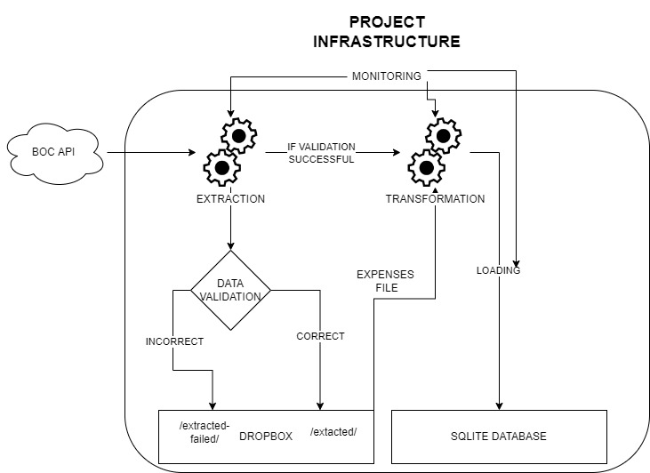

# python-ETL

My take on a simple ETL pipeline presented by *Mean, Median and Moose*.

---

## Introduction

In this project I take an ETL pipeline described in the YouTube video by *Mean, Median and Moose* [ [1] ](#1)
and refactor it.
My aim is to make the project more modular and easier to use/debug.
Additionally I plan to make more extensive use of Object Oriented Programming paradigm, 
in comparison to the original, more 'linear' style of the project.
Original project can be found in the GitHub repository [ [2] ](#2)

When it comes to data loading part of the project I decided to store also the raw JSON data coming from 
the Bank of Canada. For that purpose I used python Dropbox API [ [3] ](#3). Such a practice was recommended in another YouTube
video related to data pipelines [ [4] ](#4)

---

## ETL pipeline diagram

---

## References

<a id="1">[1]</a> https://www.youtube.com/watch?v=InLgSUw_ZOE&t=759s&ab_channel=Mean%2CMedianandMoose

<a id="2">[2]</a> https://github.com/dsartori/ETLDemo

<a id="3">[3]</a> https://www.dropbox.com/developers/documentation/python

<a id="4">[4]</a> https://www.youtube.com/watch?v=pzfgbSfzhXg

- https://petl.readthedocs.io/en/stable/intro.html (PETL docs)
- https://www.bankofcanada.ca/valet/docs (BOC API docs)

---

@Author: Aleksander Wojnarowicz
